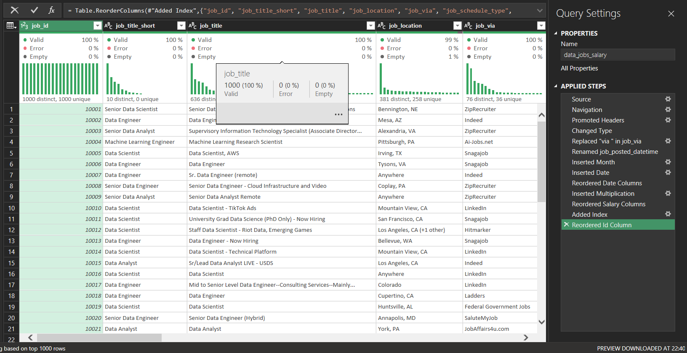
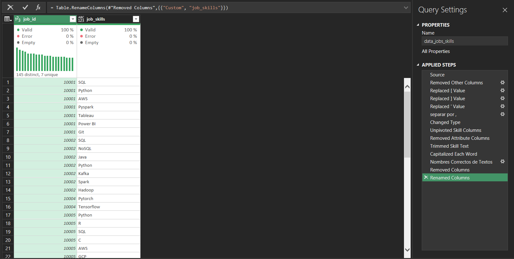
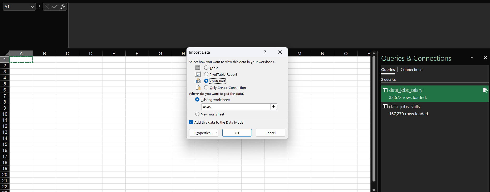
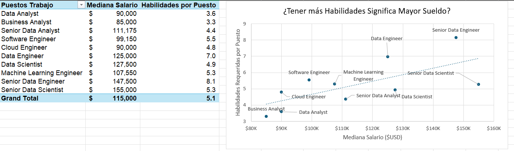
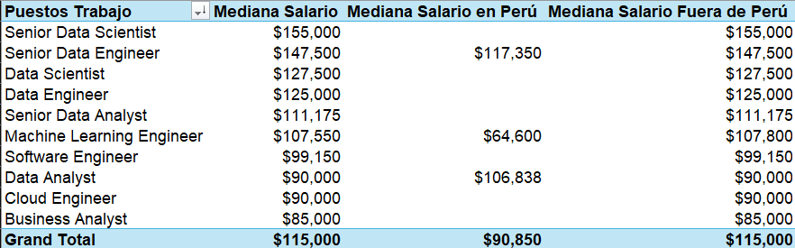
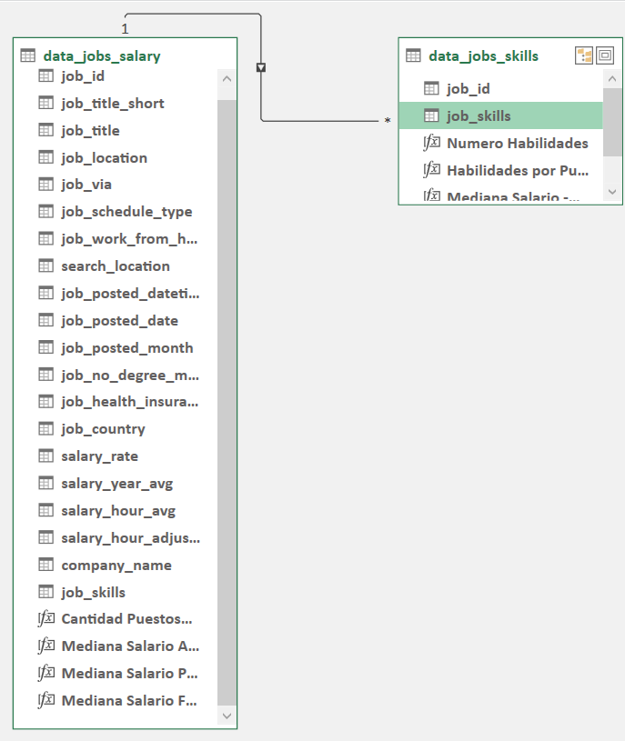
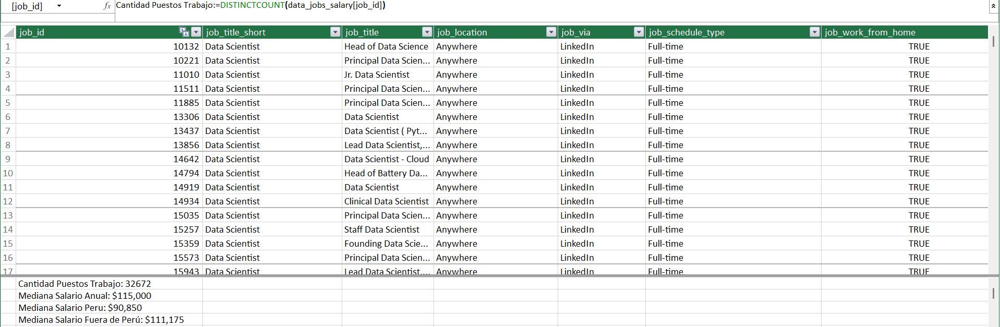
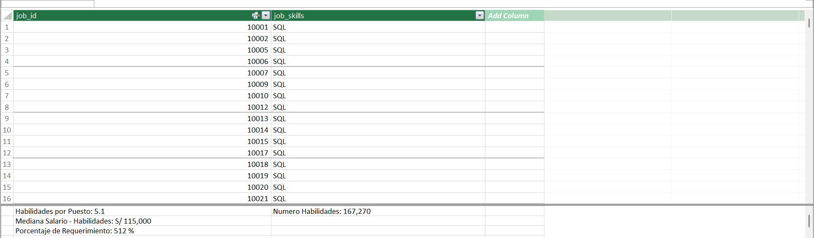
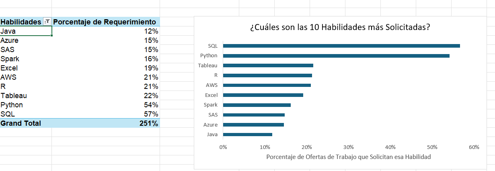
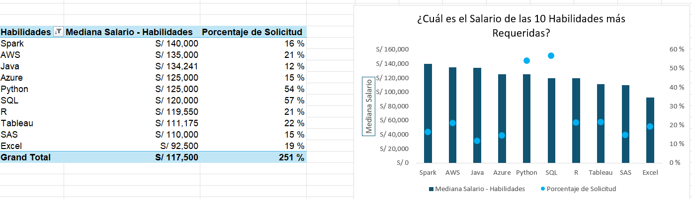

# Análisis Puestos Trabajo

## Introducción 
---
Este análisis, esta enfocado, en poder detectar cuales son las habilidades con mejores sueldos y con mayor requerimiento, para poder entender que habilidades pueden dar mejor oportunidades en el mercado laboral. 

### Preguntas de Análisis 
---
Con el objetivo de entender, mejor los requerimientos laborales, se plantean 4 preguntas: 
- ¿Tenes más habilidades implica tener un mayor salario?
- ¿Cuál es la variación de los salarios según la región?
- ¿Cuales son las habilidades más requeridas?
- ¿Cuál es el salario para las 10 habilidades más requeridas?
### Herramientas de Excel Utilizadas
---
* Tablas Dinámicas 
* Gráficos Dinámicos. 
* Power Query.
* Power Pivot.
* Dax (Data Analysis Expressions). 
## 1. ¿Qué habilidades son mejor pagadas?
### Habilidad Usada: Power Query (ETL)
#### Extraer: 
Se utilizar Power Query, para poder extraer la información del archivo original `data_salary_all.xlsx`. 
#### Transformar: 
Se transforma la información original en 2 tablas diferentes. 
- **data_jobs_salary:** Tabla original, con algunas modificaciones, añadiendo adicional un id, para cada registro.  

- **data_jobs_skills:** Tabla de las habilidades requeridas, para cada solicitud.  

#### Load (cargar);
Finalmente todo se carga en la hoja de calculo de Excel, para realizar tablas o gráficos.  

### Análisis 
#### Interpretación:
* Existe una correlación positiva entre el número de habilidades requeridas y la mediana del salario anual. 
* Aquellos roles con menor cantidad de habilidades, tienen salario más bajos como Business Analyst y Data Analyst.  

**Conclusión:** Este análisis demuestra la importancia de adquirir múltiples habilidades relevantes, principalmente para las personas que aspiran a tener salarios extremadamente altos.

## 2. ¿Cuál es la variación de los salarios según la región?
### Habilidad Usada: Tabla Dinámica y DAX
#### Tabla Dinámica: 
* Se crea una Tabla Dinámica utilizando los datos del modelo cargado. 
* Se añaden columnas relevantes, como **job_title_short** y **salary_year_avg**.
#### DAX
* Se añade una nueva métrica utilizando DAX, para calcula la mediana del salario anual:
```
Mediana Salario Anual: =  =MEDIAN(data_jobs_salary[salary_year_avg])
* Se añade una nueva métrica utilizando DAX
```
* Se añade una nueva métrica utilizando DAX, para calcular la mediana del salario anual en Perú:
```
Mediana Salario en Peru: =CALCULATE(
                          MEDIAN(data_jobs_salary[salary_year_avg]);
                          data_jobs_salary[job_country] = "Peru"
                          )
```
* Se añade una nueva métrica utilizando DAX, para calcular la mediana del salario anual para ofertas fuera de Perú: 
```
Mediana Salario Fuera de Peru: =CALCULATE(
    MEDIAN(data_jobs_salary[salary_year_avg]);
    data_jobs_salary[job_country] <> "Peru"
)
```
### Análisis 
#### Interpretación:
* Los salarios de puestos **Senior**, son aquellos que lideran los puestos mejor pagados, con excepción de Senior Data Analyst, en Perú específicamente el puesto con mejor salario ese el de **Senior Data Engineer**. 
* No existen muchas ofertas de trabajo para, Perú, dejando 7 de 10 puestos, sin ofertas, cuando en el mercado global estos puestos tienen alta demanda, los salarios fuera de Perú son notoriamente más altos.  
  
**Conclusión:** Los salarios, se ven influenciados fuertemente por el País donde se realizan las ofertas, además de ellos, en países como Perú, ni siquiera existen ofertas para todos los puestos relacionados a datos, mostrando un mayor grado de dificultad para encontrar trabajo en esta área.

## 3. ¿Cuales son las habilidades más requeridas?
### Habilidad Usada: Power Pivot 
* Se crea un modelo relacional entre las dos tablas creadas anteriormente con Power Query.

* Menú de Power Pivot para la tabla `data_jobs_salary`:

* Menú de Power Pivot para la tabla `data_jobs_skills`:  

  
### Análisis 
#### Interpretación:
* Las habilidades más requeridas son **SQL**, **Python** y **Tableu**, todas estas herramientas reflejan la importancia del procesamiento de dato y de cierta manera se puede interpretar que cada una cumple una función específica, SQL para almacenar información y realizar consulta puntuales, Python para transformar información y ciencia de datos y Tableu para visualizar información.   
* Otras habilidades a tener en cuenta son **R** y **AWS**, R para análisis estadísticos y AWS para servicios en la nube. 
  
**Conclusión:** Conocer las habilidades más demandadas por el mercado no solo ayuda a mantenerse presente en el marcado laboral, también ayuda a seguir estudiando e investigando sobre las nuevas tecnologías.

## 4. ¿Cuál es el salario para las 10 habilidades más requeridas?
### Habilidad Usada: Gráficos Avanzados (Gráficos Dinámicos)
* Se crea un gráfico dinámico de combinado, con la mediana del salario y el porcentaje de solicitud.
  - **Eje primario:** Mediana Salario Anual (como un gráfico de barras).
  - **Eje Secundario:** Porcentaje de Participación (como un gráfico de líneas con marcadores). 
### Análisis 
#### Interpretación:
* Las habilidades como **Spark**, **AWS** y **Java**, son aquellas con salarios más altos a pesar de tener unos porcentajes de solicitud más bajos, esto remarca que son habilidades críticas para el mundo de los datos pero que tienen pocos puestos disponibles que usen estás habilidades.   
* Habilidades como  **SQL** y **Python**, tienen un salario intermedio sin embargo, el nivel de solicitud esta por encima del 50%, es decir son 2 habilidades muy requeridas y con salarios aceptables.  
  
**Conclusión:** Existen habilidades que tienen pocas ofertas de trabajo, sin embargo, tiene salarios altos, por lo mismo que suelen ser cargos más especializados, por otro lado habilidades con alta demanda como **SQL** y **Python** tienen un salario aceptable, a mi interpretación aprender estas 2 habilidades te habré la puerta a muchas ofertas de trabajo y también te permite aspirar a salarios aceptables. 
## Resumen
--- 
El presente proyecto, permite realizar un análisis en Excel, para identificar las mejores habilidades para aprender si uno se quiere involucrar en el mundo de los datos y permite identificar aquellos puestos y habilidades que tienden a tener mejores salarios, para ello se utilizan diversas herramientas como Power Query, Power Pivot, DAX, tablas dinámicas y gráficos dinámicos,  
## Sobre Mi 
---
Buenos días, buenas tardes o buenas noches, dependiendo de cuando leas esto, soy un Estudiante de Ing. Sistemas mi nombre es Danfer Marcelo Ore, me quiero especializar en análisis de datos, este proyecto busca demostrar mi manejo de Excel esta vez un con herramientas más avanzadas y que requieren un conocimiento más profundo de Excel. 
