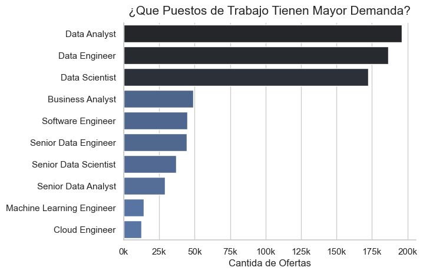
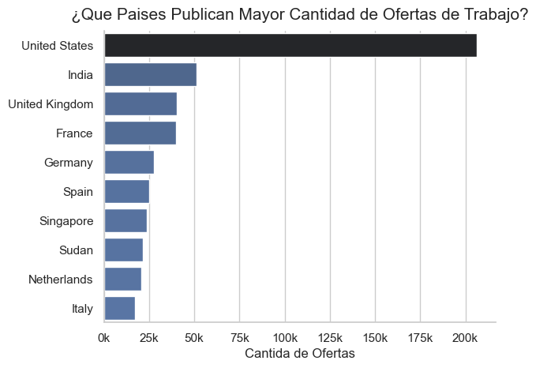
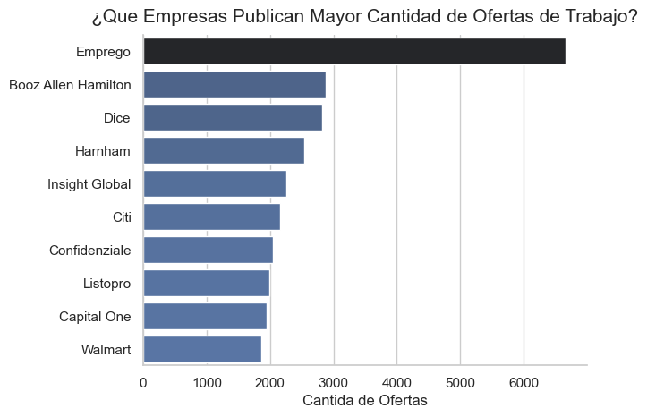
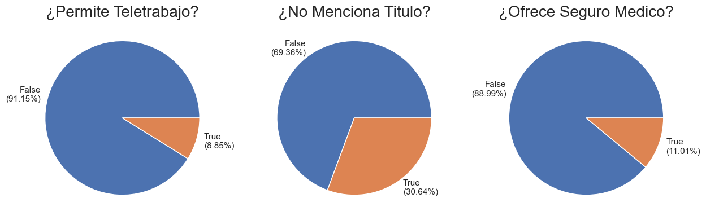
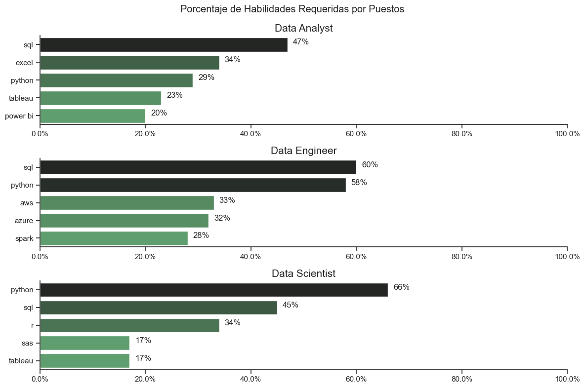
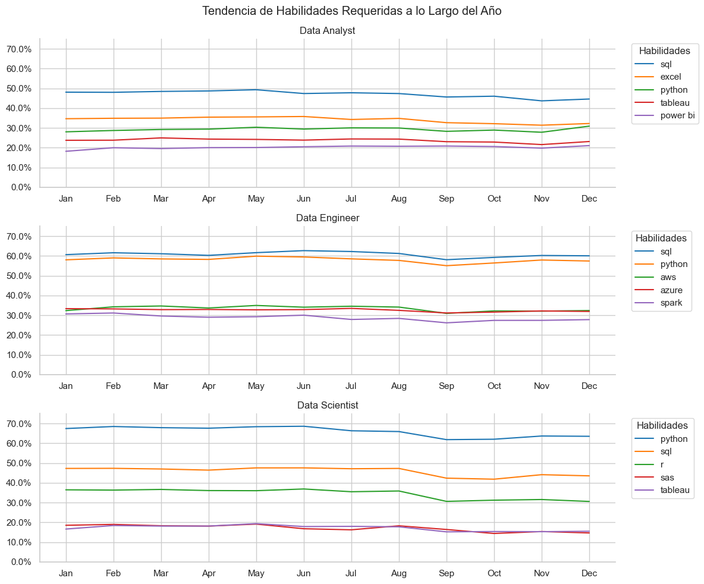
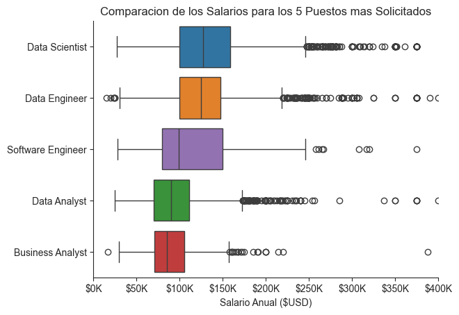
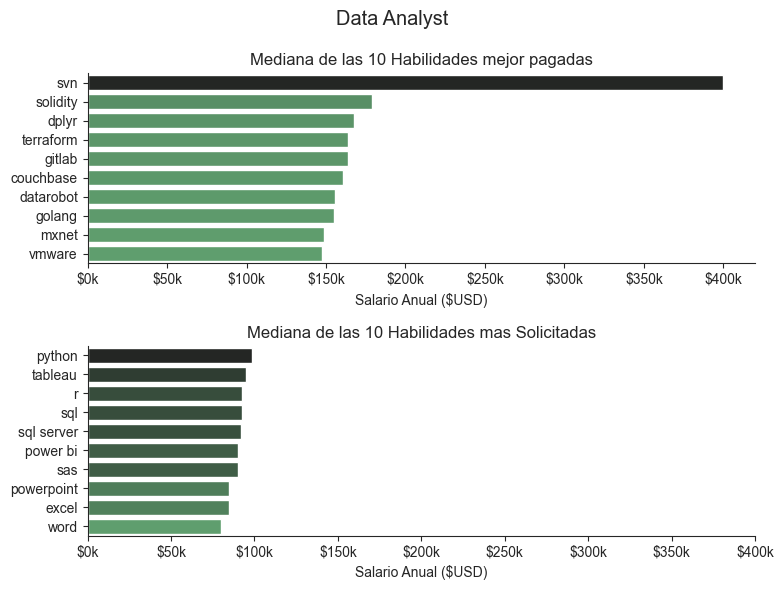
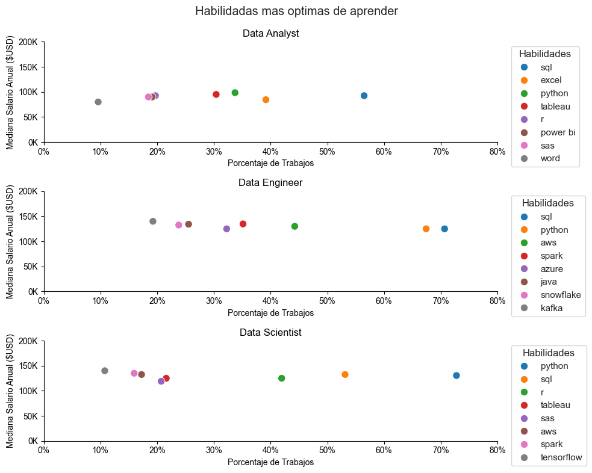
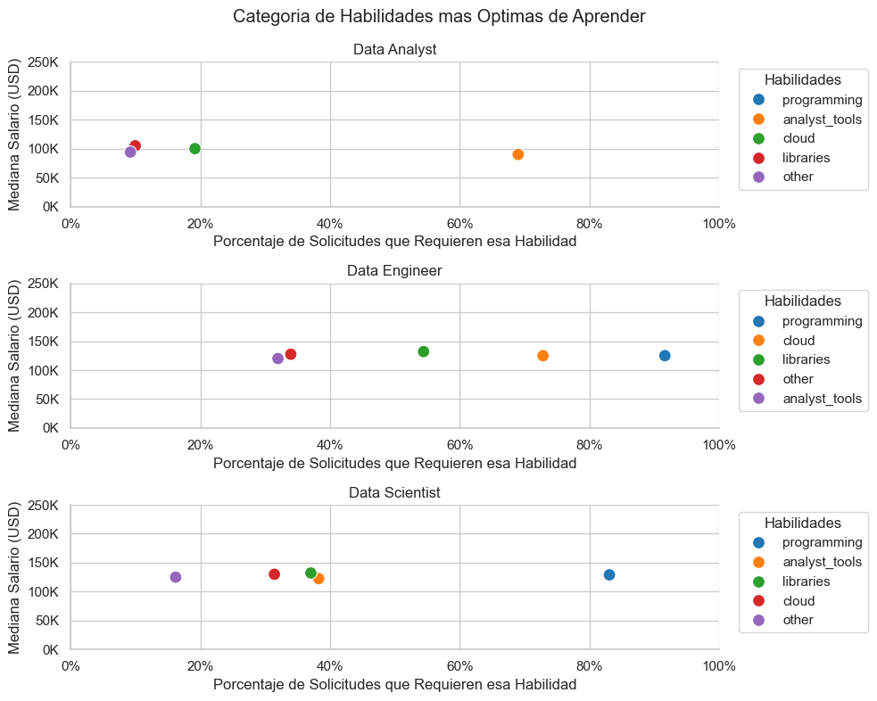

# Análisis de Ofertas Labores para Trabajos Relacionados a Datos 

1. [Introducción](#Introducción)  
2. [Preguntas a Responder](#Preguntas-a-Responder)  
3. [Herramientas Utilizadas](#Herramientas-Utilizadas)
4. [Preparación de la información y limpieza ](#Preparación-de-la-información-y-limpieza)
5. [EDA](#EDA)
6. [Análisis](#Análisis)
7. [Conclusiones](#Conclusiones)
8. [Sobre Mi](#Sobre-Mi)
## Introducción 
---
Ente proyecto, esta centrado en analizar las diversas ofertas laborales relacionadas al mundo de los datos, para ello se utilizan diversas herramientas para el procesamiento, limpieza, transformación y visualización de la información. 

## Preguntas a Responder 
---
1. ¿Qué habilidades son las más requeridas para los 3 puestos con más ofertas?
2. ¿Cuál es la tendencia del requerimiento de habilidades a lo largo del año?
3. ¿Cuál es el salario para las puestos con más ofertas?
4. ¿Qué habilidades son más optimas de aprender según el puesto?
5. ¿Qué categoría de habilidades son más optimas de aprender según el puesto?


## Herramientas Utilizadas 
---
Para la ejecución de este análisis, utilice diversas herramientas aprovechándome de los beneficios que estás brindan: 
- **Python:** Es la base de este análisis, es un lenguaje flexible, fácil de entender y de programar, también utilice las siguientes librerías:
    - Pandas: Utilice esta librería para transformar tipos de datos, analizar y transformar los datos.
    - Matplotlib: Permite visualizar la información mediante gráficos. 
    - Seaborn: Permite crear gráficos más avanzados y potentes.
- Jupyter Notebooks: Herramienta utilizada para ejecutar el código y que me permitió añadir anotaciones y diversos gráficos en un solo archivo.
- Visual Studio Code: Herramienta utilizada para poder ejecutar código en Python y gestionar entornos.
- GitHub: Herramienta utilizada para poder controlar las versiones y el flujo de trabajo colaborativo. 
## Preparación de la información y limpieza 
---
Etapa inicial donde cambio los tipos de datos, realizo diversas modificaciones y cargo este nuevo archivo en formato parquet: 

### Etapas ETL

#### Extracción de los datos  
Se extrae la información del archivo `data_jobs.csv`
```python
import pandas as pd 
from rutas import ruta_archivo_original, ruta_archivo_limpio
import ast

df = pd.read_csv(ruta_archivo_original())
df
```
#### Transformación de los datos
Se transforma la información para cambiar tipos de datos e información relevante: 
```python
# columna 'job_posted_date' de tipo de dato 'str' a 'date'
df['job_posted_date'] = pd.to_datetime(df.job_posted_date)

# columna 'job_skills' de tipo de dato 'str' a 'list'
df['job_skills'] = df.job_skills.apply(
    lambda lista: ast.literal_eval(lista) 
    if pd.notna(lista) 
    else lista
    ) 

# columna 'job_type_skills' de tipo de dato 'str' a 'dict'
df['job_type_skills'] = df.job_type_skills.apply(
    lambda dict: ast.literal_eval(dict) 
    if pd.notna(dict) 
    else dict
    )
```
#### Carga de los datos 
Se cargan el data frame con todas las modificaciones en un nuevo archivo con formato parquet: 
```python
df.to_parquet(ruta_archivo_limpio())
```
- ¿Por qué utilizar `.parquet` y no `.csv`?
  - **Ocupa menos espacio:** Parquet utiliza compresión y un formato de almacenamiento columnar, por lo que normalmente los archivos ocupan menos espacio que los CSV.
  - **Conserva los tipos de datos:** Parquet almacena información sobre el esquema y los tipos de datos, como fechas, números, booleanos, etc. Además, puede representar estructuras más complejas, como listas o diccionarios, dependiendo de las herramientas utilizadas.
  - **Mayor eficiencia en el procesamiento:** Al ser un formato columnar, permite leer únicamente las columnas necesarias y procesar grandes volúmenes de datos de forma más eficiente que un CSV.
  - **Mantiene el esquema de los datos:** A diferencia del CSV, que básicamente almacena texto separado por delimitadores, Parquet conserva información sobre la estructura y los tipos de las columnas.

## EDA
--- 
Pequeño análisis exploratorio de los datos con la finalidad de tener un contexto general de la información que se va analizar: 
### ¿Qué Puestos de Trabajo Tiene Mayor Demanda?
```python
# Seleccion de los 10 puestos con mayores ofertas 
top_10_puestos = df_trabajar.job_title_short.value_counts().head(10).to_frame()

# Grafico y modificacion del aspecto visual 
sns.set_theme(style='whitegrid')
sns.barplot(
    data=top_10_puestos,
    x='count',
    y='job_title_short',
    hue='count',
    palette='dark:b_r',
    legend=False
)
```

**Interpretación**: Los puestos de junior, son aquellos que tienen mayor demanda, por otro lado, los puestos de senior, tienen una demanda más baja al ser cargos que requieren mayor especialización, sin embargo, algo curioso es que los puestos de **Machine Learning Engineer** y de **Cloud Engineer** son los puestos de trabajo que tienen menos ofertas, esto puede ser, porque, ambas las suelen utilizar solo empresas grandes.

### ¿Qué Países Publican Mayor Cantidad de Ofertas de Trabajo?
```python
# Seleccion de los 10 puestos con mayores ofertas 
top_10_paises = df_trabajar.job_country.value_counts().head(10).to_frame()

# Grafico y modificacion del aspecto visual 
sns.set_theme(style='whitegrid')
sns.barplot(
    data=top_10_paises,
    x='count',
    y='job_country',
    hue='count',
    palette='dark:b_r',
    legend=False
)
```

**Interpretación**: En términos generales los países más desarrollados y del primer mundo son aquellos que brindan más ofertas, liderando Estados Unidos, seguí de India que sería un caso especial, porque no es un país muy desarrollado, sin embargo, si tiene una gran cantidad de ofertas tecnológicas y fruto de ello brindan más oportunidades. 

### ¿Qué Empresas Publican Mayor Cantidad de Ofertas de Trabajo?
```python
# Seleccion de los 10 puestos con mayores ofertas 
top_10_empresas = df_trabajar.company_name.value_counts().head(10).to_frame()

# Grafico y modificacion del aspecto visual 
sns.set_theme(style='whitegrid')
sns.barplot(data=top_10_empresas,
            x='count',
            y='company_name',
            hue='count',
            palette='dark:b_r',
            legend=False
)
```

**Interpretación**: La empresa **Emprego**, es con diferencia la empresa que tiene mayor cantidad de ofertas de trabajo, aunque, en realidad es una plataforma similar a LinkedIn, el resto de empresas son empresas centradas en tecnologías con excepción de Walmart que es del sector retail, en términos generales como es de esperarse las empresas tecnológicas son las que más ofertas de trabajos relacionados a datos.

### ¿Cuales son los Beneficios y Requisitos laborales?
```python
dic_columnas_titulo = {
    'job_work_from_home': '¿Permite Teletrabajo?',
    'job_no_degree_mention': '¿No Menciona Titulo?',
    'job_health_insurance': '¿Ofrece Seguro Medico?'
}
fig, ax = plt.subplots(1,3,figsize= (15,10))

for i, (columna,titulo) in enumerate(dic_columnas_titulo.items()):
    analisis_beneficios = df_trabajar[columna].value_counts()
    
    # Etiquetas de Verdadero/Falso (Porcentaje)
    etiquetas = [
        f"{etiqueta}\n({round(analisis_beneficios.loc[etiqueta]/analisis_beneficios.sum()*100,2)}%)"
        for etiqueta in analisis_beneficios.index
    ]
    analisis_beneficios.plot(kind='pie',ax=ax[i],labels=etiquetas )
    ax[i].set_title(titulo,fontsize=20)
    ax[i].set_ylabel('')
```

**Interpretación**: El sector tecnológico parece que todavía se mantiene firme en el trabajo presencial teniendo un 91% de las empresas teniendo trabajo presencial, por otro lado parece que el titulo tiene una importancia alta pero cada vez es menos necesaria teniendo que el 30% de las empresas no solicitan titulo para trabajar, y finalmente algo sorprendente es que el 88% de los trabajos no ofrecer seguros médicos, esto se puede deber a la modalidad de las ofertas que se publican o también a la leyes de cada país donde se publican estas ofertas. 
## Análisis 
---
### ¿Qué habilidades son las más requeridas para los 3 puestos con más ofertas?
```python
# Lista del nombre de los 3 roles con mayor cantidad de ofertas 
top_3_roles = df_trabajar.job_title_short.value_counts().head(3).index.to_list()

sns.set_theme(style='ticks')
fig, ax = plt.subplots(3,1,figsize= (12,8))

for i,rol in enumerate(top_3_roles): 
    # Cantidad total de ofertas de trabajo
    cantidad_filas = len(df_trabajar[df_trabajar.job_title_short == rol])
    # Filtra por rol y exapandimos 
    df_explode = df_trabajar[df_trabajar.job_title_short == rol].explode('job_skills')
    
    # TOP 5 habilidades más requeridas 
    df_grafico = df_explode[df_explode.job_title_short == rol].job_skills.value_counts().head(5).to_frame()
    
    # Calcula el porcentaje para cada uno 
    df_grafico['porcentaje'] = df_grafico['count'].apply(lambda valor: int(valor/cantidad_filas *100))
    
    # Grafico y Diseño
    sns.barplot(data=df_grafico,
                y= 'job_skills',
                x='porcentaje',
                ax=ax[i],
                hue='porcentaje',
                palette='dark:g_r',
                legend=False
    )
```
  
**Interpretación**: Como es de esperar, las habilidades varían según el puesto, sin embargo, existe 2 habilidades que mantienen una gran participación en los 3 puestos estas son **Python** y **SQL**, es decir, si alguien quiere ingresas al mundo de los datos, sin importan el área de especialización esta prácticamente obligado a manejar **Python** y **SQL**, luego las habilidades varían mucho según la especialización, para Data Analyst se priorizan habilidades como Excel, Power BI o Tableu, herramientas de visualización, para Data Engineer se priorizan tecnologías de nube y grandes volúmenes de datos como AWS, Azure y Spart y para Data Scientist se prioriza herramientas de análisis estadístico como R o sas.

### ¿Cuál es la tendencia del requerimiento de habilidades a lo largo del año?
```python
# Lista del nombre de los 3 roles con mayor cantidad de ofertas 
top_3_roles = df_trabajar.job_title_short.value_counts().head(3).index.to_list()

sns.set_theme(style='whitegrid')
fig, ax = plt.subplots(3,1,figsize= (12,10))
for i, rol in enumerate(top_3_roles): 
    df_grafi_tra = df_trabajar[df_trabajar.job_title_short == rol].copy()
    df_grafi_tra['mes_num'] = df_grafi_tra.job_posted_date.dt.month
    
    # cantidad de filas por número de mes 
    canti_por_mes = df_grafi_tra.mes_num.value_counts().sort_index()
    
    # Expande la lista de hábilidades 
    df_explode = df_grafi_tra.explode(column='job_skills')
    
    # top 5 habilidades por cada mes 
    df_pivot_table = df_explode.pivot_table(index='mes_num',columns='job_skills',aggfunc='size')
    df_pivot_table.loc['total'] = df_pivot_table.sum()
    df_pivot_table = df_pivot_table[df_pivot_table.loc['total'].sort_values(ascending=False).index]
    df_pivot_table = df_pivot_table.iloc[:,0:5]
    df_pivot_table.drop(index='total',inplace=True)
    
    # Divide el total de las skills por mes entre el total del mes para obtener el porcentaje
    df_porcentaje = df_pivot_table.div(canti_por_mes/100,axis=0)
    
    # Cambia el formato de numero de mes a mes corto 
    df_grafico = df_porcentaje.reset_index()
    df_grafico['mes_nombre'] = pd.to_datetime(df_grafico.mes_num,format='%m').dt.strftime('%b')
    df_grafico.set_index('mes_nombre',inplace=True)
    df_grafico.drop(columns='mes_num',inplace=True)
    
    # Grafico y Diseño 
    sns.lineplot(data=df_grafico,dashes=False,palette='tab10',ax=ax[i])
    ax[i].set_title(rol)
    ax[i].yaxis.set_major_formatter(plt.FuncFormatter(lambda y,pos: f'{y}%'))
    ax[i].set_xlabel('')
    ax[i].set_ylim(0,75)
    ax[i].legend(title="Habilidades", bbox_to_anchor=(1.02, 1), loc="upper left")
```
  
**Interpretación**: La habilidades que son más estables son **SQL** y **Python**, sin embargo, tienen una pequeña caída en los meses de Agosto y Noviembre y nuevamente comienzan a tener mayor relevancia en Diciembre, el resto de habilidades tienen pequeñas variaciones a lo largo del año, pero nada con un gran impacto. 

### ¿Cuál es el salario para las puestos con más ofertas?
```python
# top 5 trabajos 
top_5_trabajos = df_trabajar.job_title_short.value_counts().head(5).index.to_list()

# Orden de los 5 trabajos mas solicitados 
orden_trabajos = (df_trabajar[(df_trabajar.job_title_short.isin(top_5_trabajos)) & (df_trabajar.salary_year_avg.notna())]
                .groupby('job_title_short')['salary_year_avg']
                .median()
                .sort_values(ascending=False)
                .index
                .to_list()
)
# Filtramos por los top 5 trabajos 
df_media_compa = df_trabajar[(df_trabajar.job_title_short.isin(top_5_trabajos)) & (df_trabajar.salary_year_avg.notna())]

# Grafico y diseño 
sns.set_style(style='ticks')
sns.boxplot(data=df_media_compa,y='job_title_short',x='salary_year_avg',hue='job_title_short',palette='tab10',order=orden_trabajos)
sns.despine()
plt.title('Comparacion de los Salarios para los 5 Puestos mas Solicitados')
plt.ylabel('')
plt.xlabel('Salario Anual ($USD)')
plt.xlim(0,400000)
ax = plt.gca()
ax.xaxis.set_major_formatter(plt.FuncFormatter(lambda x,pos: f'${int(x/1000)}K'))
```
  
**Interpretación**: La mediana de los salarios anuales para los 5 puestos con más demanda van desde 80k hasta los 130k, el salario con mejor mediana es el salario para Data Scientist, aunque también presenta una gran cantidad de atípicos para valores superiores.  
Existe mucha variación en los salarios fruto, de tener datos de diversos países y empresas, que generan esta gran variación, además también existen variedad de atípicos, especialmente para puestos como Data Scientist, Data Analyst y Data Engineer, esto puede ser por la variación de países mencionada anterior mente, pero también por la variación de las exigencias a pesar de ser el mismo puesto.  
```python
# top 3 trabajos 
top_3_trabajos = df_trabajar.job_title_short.value_counts().head(3).index.to_list()

for i, rol in enumerate(top_3_trabajos):
    fig, ax = plt.subplots(2,1,figsize =(8,6))
    
    sns.set_theme(style='ticks')
    
    df_filtrado = df_trabajar[(df_trabajar.job_title_short == rol) & (df_trabajar.salary_year_avg.notna())]
    
    #---------------------------------------
    # GRAFICO Mediana Habilidad Mejor Pagada
    #---------------------------------------
    g_mejor_pag = df_filtrado.explode('job_skills')
    g_mejor_pag = g_mejor_pag.groupby('job_skills').agg(
        mediana_salario_anual = ('salary_year_avg','median')
    ).sort_values(by='mediana_salario_anual',ascending=False).head(10)
    
    # Grafico y Diseño
    sns.barplot(data=g_mejor_pag,
                y=g_mejor_pag.index,
                x='mediana_salario_anual',
                ax=ax[0],
                hue='mediana_salario_anual',
                palette='dark:g_r',
                legend=False
    )
    ax[0].set_title('Mediana de las 10 Habilidades mejor pagadas')
    ax[0].set_ylabel('')
    ax[0].set_xlabel('Salario Anual ($USD)')
    ax[0].set_xlim(0,420000)
    ax[0].xaxis.set_major_formatter(plt.FuncFormatter(lambda x,pos: f'${int(x/1000)}k'))
    
    #-----------------------------------------
    # GRAFICO Mediana Habilidad Mas Solicitada
    #-----------------------------------------
    g_mas_solicitado = df_filtrado.explode('job_skills')
    g_mas_solicitado = (
        g_mas_solicitado.groupby('job_skills')
        .agg(
        repeticiones_habilidad = ('job_skills','count'),
        mediana = ('salary_year_avg','median')
        )
        .sort_values(by='repeticiones_habilidad',ascending = False)
        .head(10)
        .sort_values(by='mediana',ascending=False)
    )
    
    sns.barplot(data=g_mas_solicitado,
                y=g_mas_solicitado.index,
                x='mediana',
                ax=ax[1],
                hue='mediana',
                palette='dark:g_r',
                legend=False
    )
    ax[1].set_title('Mediana de las 10 Habilidades mas Solicitadas')
    ax[1].set_ylabel('')
    ax[1].set_xlabel('Salario Anual ($USD)')
    ax[1].set_xlim(0,400000)
    ax[1].xaxis.set_major_formatter(plt.FuncFormatter(lambda x,pos: f'${int(x/1000)}k'))
    
    #---------------------------
    # Diseño general del subplot
    #---------------------------
    sns.despine()
    fig.suptitle(rol)
    fig.tight_layout()
```
  
*Para esta ocasión me voy a centrar solo en Data Analyst*  
**Interpretación**: 
- Para las habilidades mejor pagas, es evidente que muestran valores atípicos especialmente para svn que prácticamente llega a un salario anual de $400k, sin embargo, los más probable, es que estas habilidades sean solicitadas de manera puntual por empresas especializadas en un rubro, aprender este tipo de habilidades no significa tener salarios tan altos, ni tampoco, que sean habilidades que se usen de manera recurrente. 
- Para las habilidades con más ofertas, en términos generales, prácticamente todas tienen la misma mediana de salario anual, que suele ir desde los $75k hasta los $82K, aprender este tipo de habilidades, si da mayor oportunidades laborales y tiene más probabilidades de tener un salario equivalente a la mediana.  
### ¿Qué habilidades son más optimas de aprender según el puesto?
```python
# Selección de los 3 puestos de trabajos más solicitados 
top_3_trabajos = df_trabajar.job_title_short.value_counts().head(3).index.tolist()

fig,ax = plt.subplots(3,1,figsize=(10,8))

sns.set_theme(style='whitegrid')
for i, rol in enumerate(top_3_trabajos):
    df_filtrar = df_trabajar[(df_trabajar.job_title_short==rol) & (df_trabajar.salary_year_avg.notna())]
    total_registros = len(df_filtrar)
    
    # Expandimos por habilidades 
    g_dispersion = df_filtrar.explode('job_skills')
    
    g_dispersion = (
        g_dispersion.groupby('job_skills')
        .agg(
        cantidad_ofertas = ('job_skills','count'),
        mediana_salario = ('salary_year_avg','median')
        )
        .sort_values(by='cantidad_ofertas',ascending=False)
        .head(8)
    )
    
    g_dispersion['porcentaje'] = g_dispersion.cantidad_ofertas.div(total_registros/100)
    
    sns.scatterplot(
        data=g_dispersion,
        x='porcentaje',
        y='mediana_salario',
        hue=g_dispersion.index,
        s=80,
        ax=ax[i],
        palette='tab10'
    )
    
    ax[i].set_title(rol)
    ax[i].set_xlabel('Porcentaje de Trabajos')
    ax[i].set_ylabel('Mediana Salario Anual ($USD)')
    ax[i].set_xlim(0,80)
    ax[i].set_ylim(0,200000)
    ax[i].xaxis.set_major_formatter(plt.FuncFormatter(lambda x,pos: f'{int(x)}%'))
    ax[i].yaxis.set_major_formatter(plt.FuncFormatter(lambda y,pos: f'{int(y/1000)}K'))
    ax[i].legend(title="Habilidades", bbox_to_anchor=(1.02, 1), loc="upper left")
fig.suptitle('Habilidadas mas optimas de aprender')
sns.despine()
fig.tight_layout()
```
  
**Interpretación**: Las habilidades mantienen un rango salarial, bastante estable, a excepción de Data Scientist, que tiene salarios más altos para habilidades como **Spark**, **tensorflow** y **AWS**, sin embargo, y nuevamente tomando en cuenta el porcentaje de ofertas que solicitan dichas habilidades **SQL** y **Python**, ofrecen un salario aceptable pero una gran demanda prácticamente en los 3 trabajos esas 2 habilidades se requieren en más del 50% de ofertas, después de ello existen otras habilidades relevantes, para Data Enegineer, resaltan **Azure**, **AWS** y **Spark**, con porcentajes altos y salarios aceptables. 

### ¿Qué categoría de habilidades son más optimas de aprender según el puesto?
```python
top_3_trabajos = df_trabajar.job_title_short.value_counts().head(3).index.to_list()

fig, ax = plt.subplots(3,1,figsize = (10,8))
sns.set_theme(style='whitegrid')

for i, rol in enumerate(top_3_trabajos):
    # Filtramos solo el rol y las columnas que tengan un salario anual 
    df_filtrado = df_categoria_skills[
        (df_categoria_skills.job_title_short==rol) 
        & (df_categoria_skills.salary_year_avg.notna()) 
        & (df_categoria_skills.skills.notna())
    ]
    cantidad_registros = len(df_trabajar[(df_trabajar.job_title_short==rol) & (df_trabajar.salary_year_avg.notna())])
    
    # Calcula la mediana del salario anual de cada categoría de Hábilidad y la cantidad de veces que se solicita
    df_grafico = df_filtrado.groupby('Categoria').agg(
        mediana_salario = ('salary_year_avg','median'),
        cantidad_solicitudes = ('Categoria','count')
    ).sort_values(by='cantidad_solicitudes',ascending=False).head(5)
    
    df_grafico['porcentaje'] = df_grafico.cantidad_solicitudes.div(cantidad_registros/100,axis=0)
    # Grafico y diseño 
    sns.scatterplot(
        data= df_grafico,
        x='porcentaje',
        y='mediana_salario',
        hue= df_grafico.index,
        palette='tab10',
        s= 100,
        ax=ax[i]
    )
    ax[i].set_title(rol)
    ax[i].set_ylim(0,150000)
    ax[i].set_xlim(0,100)
    ax[i].set_ylabel('Mediana Salario (USD)')
    ax[i].set_xlabel('Porcentaje de Solicitudes que Requieren esa Habilidad')
    ax[i].xaxis.set_major_formatter(plt.FuncFormatter(lambda x,pos: f'{int(x)}%'))
    ax[i].yaxis.set_major_formatter(plt.FuncFormatter(lambda y,pos: f'{int(y/1000)}K'))
    
    ax[i].legend(title="Habilidades", bbox_to_anchor=(1.02, 1), loc="upper left")
sns.despine()
fig.suptitle('Categoria de Habilidades mas Optimas de Aprender')
fig.tight_layout()
```
  
**Interpretación**: La categoría de habilidades más solicitada es programming, con un 60%, 90% y 83%, de ofertas que lo solicitan dependiendo del puesto, dicho de otra manera, si alguien quiere adentrase, en el mundo de los datos, tiene que saber programación para ser competitivo, de otra manera desperdiciarían más de la mitad de ofertas y en algunos casos hasta el 90% de estas, los salarios en general se mantienen en una categoría similar sin mucha variación, el resto de categorías de habilidades, tienden a variar según la rama, siendo las mas relevantes analyst_tools, cloud y analyst_tools, para cada puesto de trabajo respectivamente.  

## Conclusiones 
---
Luego de analizar todas la ofertas con trabajos relacionados a datos, puedo dar las siguientes conclusiones: 
- **Existe una Correlación Entre las Habilidades y los Salarios:** Las habilidades más especializadas tienden a tener salarios más altos, por la dificultad de encontrar personas con esas capacidades. 
- **Presencia Constante de Ciertas Habilidades:** Aunque la naturaleza de la tecnología y en general de la innovación sea el cambio, existen habilidades que son constantes en los puestos con mayor cantidad de demanda, estas habilidades son **SQL** y **Python**, ambos con gran presencia e importancia.
- **Valor Económico de las Habilidades:** Las habilidades tienen determinadas demandas y remuneración variante, entender a que rama se quiere especializar, permite estudiar y priorizar determinadas habilidades. 
## Sobre Mi
---
Buenos días, buenas tardes o buenas noches, dependiendo de cuando leas esto, soy Estudiante de Ing. Sistemas mi nombre es Danfer Marcelo Ore, este proyecto busca mostrar mi capacidad de análisis, utilizando diversas herramientas y tecnologías. 
