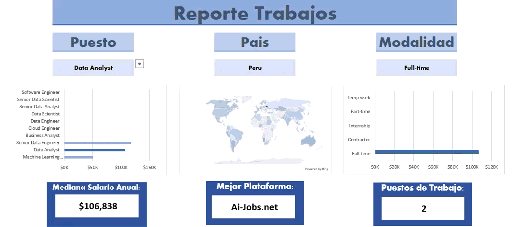
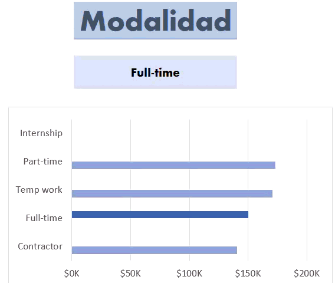
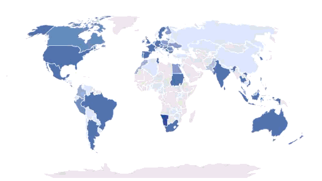

# Reporte Salarios Excel

## Introducción 
---


Este reporte esta dirigido para todas las personas que quieran buscar trabajos relacionados a datos.  
El objetivo principal de este proyecto, es mostrar los salarios, la cantidad de ofertas de trabajo y la principal plataforma para encontrar trabajo utilizada. 
## Herramientas de Exel Utilizadas 
* Formulas y funciones.
* Validación de Datos.
* Gráficos.
### Formulas y funciones
Formula para encontrar la mediana del salario anual por puesto de trabajo: 
```
=ROUND(
  MEDIAN(
    IF(
      (C3=puestos_trabajo[job_title_short])*
      (filtro_pais=puestos_trabajo[job_country])*
      (ISNUMBER(SEARCH(filtro_modalidad;puestos_trabajo[job_schedule_type])))*
      (puestos_trabajo[salary_year_avg]<>0);
      puestos_trabajo[salary_year_avg]
      )
  );
  0
)
```

Formula para encontrar la cantidad de ofertas por puesto de trabajo: 
```
=SUMPRODUCT(
  IF(
    (puestos_trabajo[job_title_short]=C15)*
    (puestos_trabajo[job_country]=filtro_pais)*
    (ISNUMBER(SEARCH(filtro_modalidad;puestos_trabajo[job_schedule_type])));
    1;
    0
  )
)
```

Formula para limpiar el texto de la modalidad de trabajo:  
```
=MID(
  C2#;
  1;
  IFS(
      ISNUMBER(SEARCH(",";C2#)); SEARCH(",";C2#)-1;
      ISNUMBER(SEARCH(" and";C2#));SEARCH(" and";C2#)-1;
      TRUE;LEN(C2#)
      )
)
```
### Validación de Datos
Validación de datos para filtrar las categorías, de puesto trabajo, país y modalidad de trabajo. Evita el ingreso de valores incorrectos y facilita el uso compartido.  

### Gráficos
Implementación de gráficos, para una mejor visualización de la información.  

## Resumen 
--- 
El presente proyecto, facilita la visualización de información y permite la segmentación de información mediante la Validación de Datos. 
**CONSIDERACION**: Esta no es la mejor manera para visualizar información, lo mejor es usar POWER BI, herramienta creada para grandes volúmenes de datos, este proyecto, buscar demostrar mis capacidades en Excel, el uso de formulas, funciones, gráficos y validación de información.
## Sobre Mi 
---
Buenos días, buenas tardes o buenas noches, dependiendo de cuando leas esto, soy un Estudiante de Ing. Sistemas mi nombre es Danfer Marcelo Ore, me quiero especializar en análisis de datos, este proyecto busca demostrar mi manejo en Excel, por lo menos a un nivel básico, con formulas y gráficos, tengo proyectos con Excel requieren mayor nivel :).
